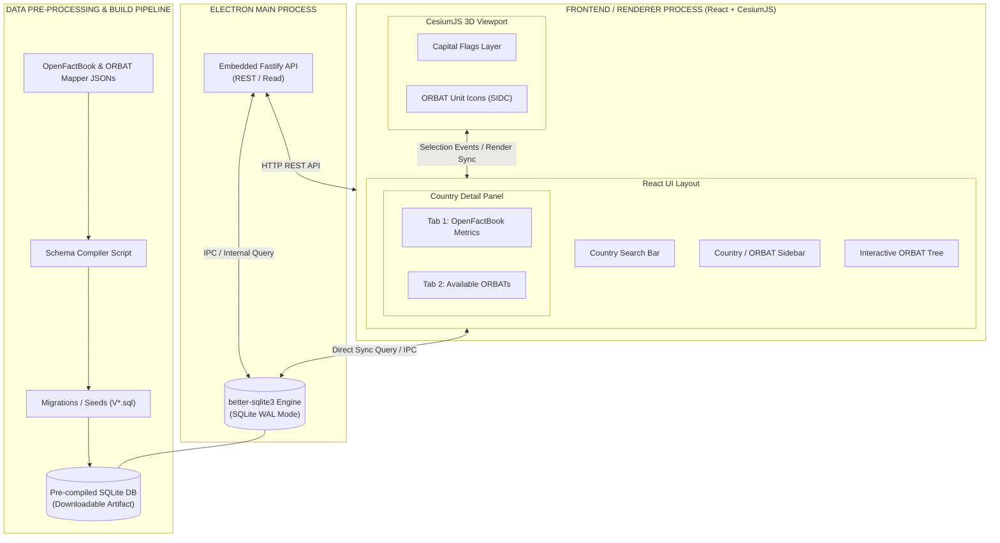
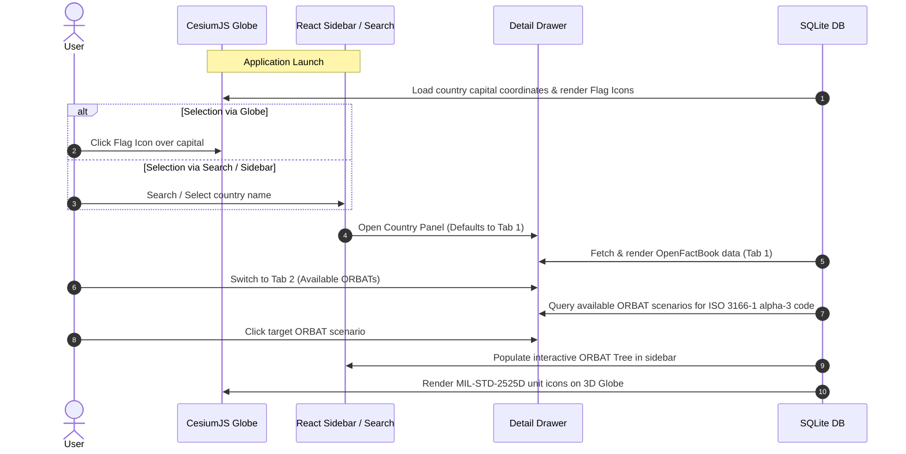

# OpenMilDB System Architecture

OpenMilDB is an embedded, single-binary desktop application built on Electron and CesiumJS for managing and visualizing hierarchical military Order of Battle (ORBAT) structures and geopolitical World Factbook datasets.

---

## 1. System Context & Overview

---

## 2. User Experience & Application Workflow

---

## 3. Core Architectural Pillars

### 3.1 Declarative Schema & Pre-built DB Pipeline
- **Defining Formats:** OpenFactBook and ORBAT Mapper JSON schemas serve as the canonical import and export data formats.
- **Automated SQL Translation:** Build scripts translate JSON schemas and raw dataset files into Flyway-style SQL migration and seed scripts (`migrations/V{N}__*.sql`).
- **Pre-compiled Distribution:** To avoid runtime performance bottlenecks associated with loading thousands of raw JSON files on startup, datasets are pre-ingested into a standalone SQLite database distributed as a downloadable asset.
- **Engine Versioning:** On initial run or update, `umzug` applies pending schema migrations and logs progress to `schema_migrations`.

### 3.2 Operational Layer (ORBAT Mapper Specification)
- **Standard:** Armed forces deployments, command hierarchies, and visual mapping vectors adhere to the **ORBAT Mapper Scenario** schema.
- **Hierarchy Mapping:** Unit trees are stored in relational SQLite tables for instant query response and exported to nested ORBAT Mapper `subordinates` arrays when requested.
- **Symbology Standard:** Symbology uses 20-digit **MIL-STD-2525D / APP-6D** Symbol Identification Codes (SIDC). Country tokens populate the text modifier overlay box (**Field CC**).

### 3.3 Geopolitical Layer (OpenFactBook Integration)
- **Standard:** National metrics adhere to the **OpenFactBook** schema format.
- **Relational Indexing:** The **ISO 3166-1 alpha-3** token (e.g., `USA`, `UKR`) links ORBAT command nodes to national profiles.
- **Capital Flag Visualization:** Coordinates derived from OpenFactBook entries render country flag billboards at capital city positions on the Cesium globe viewport.

---

## 4. Component Interface Matrix

| Interface | Protocol / Layer | Data Format | Target Functionality |
| :--- | :--- | :--- | :--- |
| **`IPC: db:getCapitals`** | Electron Bridge | JSON Array | Reads capital positions and flag icon references to plot on CesiumJS |
| **`IPC: db:getFactbook`** | Electron Bridge | JSON Object | Fetches OpenFactBook details for Tab 1 panel display |
| **`IPC: db:getOrbatsByCountry`**| Electron Bridge | JSON Array | Fetches available ORBAT scenario listings for Tab 2 |
| **`IPC: db:getOrbatTree`** | Electron Bridge | JSON Tree / Adjacency | Populates the sidebar ORBAT tree and renders unit SIDC icons on the globe |
| **`GET /api/v1/orbat`** | HTTP / Fastify | ORBAT Mapper JSON | Exposes ORBAT tree structure to external systems using standard format |
| **`GET /api/v1/factbook`** | HTTP / Fastify | OpenFactBook JSON | Exposes geopolitical metrics by ISO 3166-1 alpha-3 code |